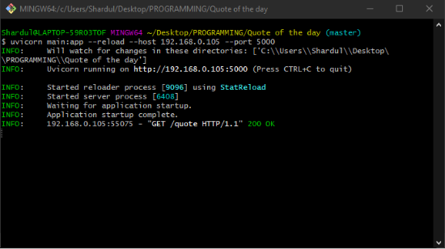
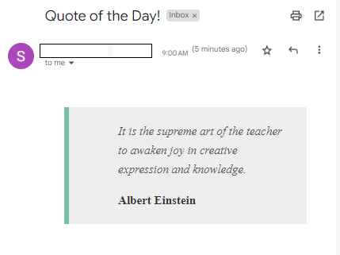

# Quotes-On-Mail

This is a successor to the previously built API, which can be found [here](https://github.com/Sudesh22/Quote-Of-The-Day-API). I have used the same API along with a Python Class for making a call to the API equipped wwith error handling facility. 

## The Class
The Class sits in the `api_class.py` file which has a few methods. The `init` method has a parameters field that can be filled with, if any parameters are to be supplied to the API. Since there's currently no need of anything as such, it is intentionally kept blank.
```Python
class CallAPI:
    def __init__(self, api):
        parameters = {
            
        }
        self.data_get_user(api, parameters)
```
 The `self.data_get_user()` method is run passing the api and the parameters. The `data_get()` method takes in the API and then requests on the API and retrieves the response.
 ```Python
 def data_get_user(self, api, parameters):
    response = requests.get(f"{api}", params=parameters)
    if response.status_code == 200:
        print("sucessfully fetched the data with parameters provided")
        self.format_print(response.json())
    else:
        print(
            f"Hello person, there's a {response.status_code} error with your request")
 ```
 The `self.format_print()` method is invoked to get the contents into a variable representing each JSON header.
 ```Python
def format_print(self, obj):
    text = json.dumps(obj, sort_keys=True, indent=4)
    text = json.loads(text)
    self.quote = text["quote"]
    self.author = text["author"]
    self.genre = text["genre"]
```
## Sending Mails
The Simple Mail Transfer Protocol (SMTP) is an application used by mail servers to send, receive, and relay outgoing email between senders and receivers. As the technology behind email communication, SMTP is the protocol that allows you to send and receive emails. I have used the Python `smtplib` module foe making this possible. There are 2 types of encryption standard protocols used to secure email transmissions. 
```markdown
1. SSL(Secure Sockets Layer)
2. TLS(Transoort Layer Security)
```
Both rely on a set of private and public keys to turn messages into useless strings of characters. If, at any stage, such an email is intercepted, it won’t be of any use to whoever compromised your security. The project showcased here is an example of both the protocols

## SSL (Secure Sockets Layer)
SSL (Secure Sockets Layer) is a cryptographic protocol for secure communication over the internet. SSL provides encryption and authentication to establish secure connections between clients and servers. It ensures confidentiality by encrypting data transmitted between the client and server. SSL authenticates the identity of the server, mitigating the risk of impersonation and man-in-the-middle attacks. SSL uses public key cryptography to securely exchange symmetric encryption keys for efficient data encryption. The `SSL` protocol is used in the `mail_ssl.py` file. 

### Importing Libraries
We start by importing all the necessary modules.
```Python
import smtplib, datetime, time, requests
from email.message import EmailMessage
from api_class import *
```

### Defining variables
All the necessary credentials are initialised. Port number `465` is used for `SSL` protocol. The smtp server used in this case is `smtp.gmail.com`. 
```Python
SENDER_EMAIL_ADDRESS = 'sender-email-address'
SENDER_EMAIL_PASSWORD = 'sender-password'
RECEIVER_EMAIL_ADDRESS = 'receiver-email-address'

ssl_port = 465
smtp_server = 'smtp.gmail.com'
```

### The SSL way of doing things
We start with a while loop that starts and checks for the current date and time and formats it into the `HH:MM:SS` format. The program is set to send mail to the users at 9 A.M., so it checks if the time is due and then makes an API call. the message content is defined in the content variable. The message variable is initialised from the `email.message` module. The `email.message` module in Python provides classes and utilities for creating, manipulating, and working with email messages. It is part of the standard library and is used to construct and modify email structures. It is initialised with the `Subject`, `To`, `From` and the `message content`. The `smtplib.SMTP_SSL()` takes in the `smtp server` and the `ssl port` and logs in to send the message. A try-catch block is implemented for error handling. It notifies the state of email status. This entire process takes 8 seconds to complete. 
```Python
while(1):
    date = datetime.datetime.strftime(datetime.datetime.now(), '%H:%M:%S')
    if date == "09:00:00":
        try: 
            api_call = CallAPI("http://192.168.0.105:5000/quote")
            content = '''
                
            '''
            msg = EmailMessage()
            msg['Subject'] = 'Quote of the Day!'
            msg['From'] = SENDER_EMAIL_ADDRESS
            msg['To'] = RECEIVER_EMAIL_ADDRESS
            msg.set_content(content, subtype='html')
            
            with smtplib.SMTP_SSL(smtp_server, ssl_port) as smtp:
                smtp.login(SENDER_EMAIL_ADDRESS, SENDER_EMAIL_PASSWORD)
                smtp.send_message(msg)
            print ("Email sent successfully!") 
                
        except Exception as excp: 
            print("Something went wrong....",excp)
    time.sleep(1)
```

## TLS (Transport Layer Security)
Similar to SSL, TLS (Transport Layer Security) is a cryptographic protocol that ensures secure communication over computer networks. TLS provides encryption and authentication to establish secure connections, commonly used in web browsing (HTTPS), email transmission (SMTPS/IMAPS/POP3S), and other network protocols. It encrypts data to protect confidentiality, preventing unauthorized access or eavesdropping. TLS verifies the identity of communicating parties through digital certificates, safeguarding against impersonation and man-in-the-middle attacks. It utilizes asymmetric cryptography for secure key exchange and symmetric encryption for efficient data transmission. TLS offers different versions and cipher suites to support strong security algorithms, ensuring the integrity and privacy of network communications. To do the same project using TLS protocol we need more or less the same approach. 

### Importing Libraries
We start by importing all the necessary modules. The `email.mime.text` module provides the `MIMEText` class, and the email.mime.multipart module provides the `MIMEMultipart` class. These classes are part of the email module in Python's standard library and are used for creating and handling `MIME (Multipurpose Internet Mail Extensions)` email messages.
```Python
import smtplib, datetime, time, requests
from email.mime.text import MIMEText
from email.mime.multipart import MIMEMultipart
from api_class import *
```

### TLS variables
All the necessary credentials are initialised. Port number `587` is used for `TLS` protocol. The smtp server used in this case is `smtp.gmail.com` as well. 
```Python
Sender_Email = "sender-email-address"
Sender_Password = "sender-password"
Receiver_Email = "receiver-email-address"

tls_Port = 587
smtp_server = 'smtp.gmail.com'
```

### The TLS Approach
The process is similar to that done for SSL. the only dufferene is that the message variable is an instance of the `MIMEMultipart()`. Here too it is suplied with the `Subject`, `To`, `From` and the `message content`. All this content is converted into a part as a `MIMEText()` object and attached to the message. In the end it is sent as a mail using `smtp.sendmail()`. The process is quit using `smtp.quit()`. This entire process takes 8 seconds to complete. 
```Python

while(1):
    date = datetime.datetime.strftime(datetime.datetime.now(), '%H:%M:%S')
    if date == "09:00:00":
        try: 
            smtp = smtplib.SMTP(smtp_server, tls_Port) 

            smtp.starttls() 

            smtp.login(Sender_Email,Sender_Password)

            api_call = CallAPI("http://192.168.0.105:5000/quote")

            content = '''
                       
            '''

            message = MIMEMultipart("alternative")
            message["Subject"] = "Quote of the Day!"
            message["From"] = Sender_Email
            message["To"] = Receiver_Email

            part1 = MIMEText(content, "html")

            message.attach(part1)

            smtp.sendmail(Sender_Email, Receiver_Email, str(message)) 
            
            smtp.quit() 
            print ("Email sent successfully!") 

        except Exception as excp:   
            print("Something went wrong....",excp)
    time.sleep(1)
```

## Starting the API
To start this API we go to the commnd line(I have used Git CLI) and enter the following line
```Shell
uvicorn main:app --reload --host 192.168.0.105 --port 5000
```

## Project in Action 
<p align=center>
  
  <p align=center>Command Line</p>
</p>

<p align=center>
  
  <p align=center>E-mail received!</p>
</p>